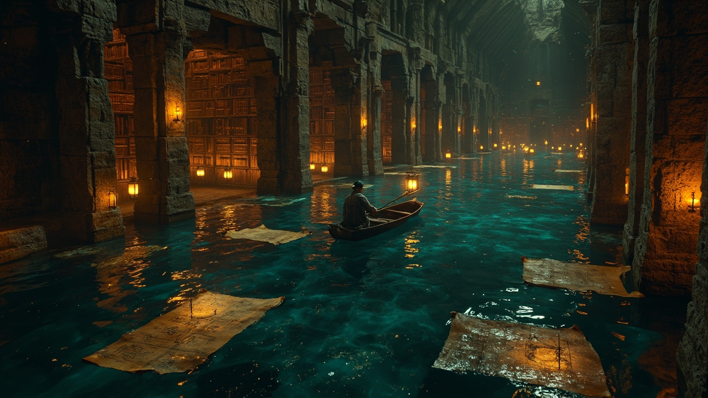
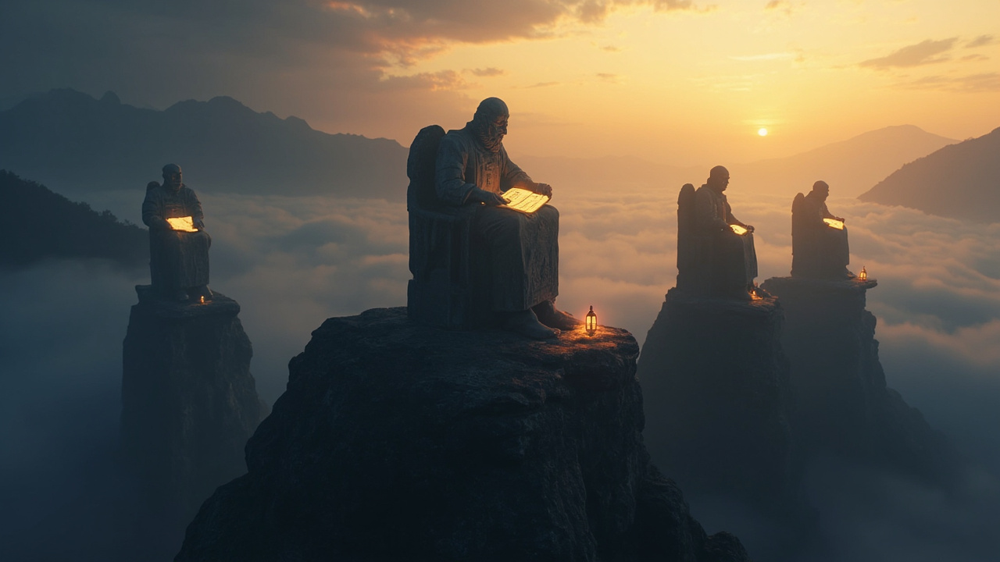
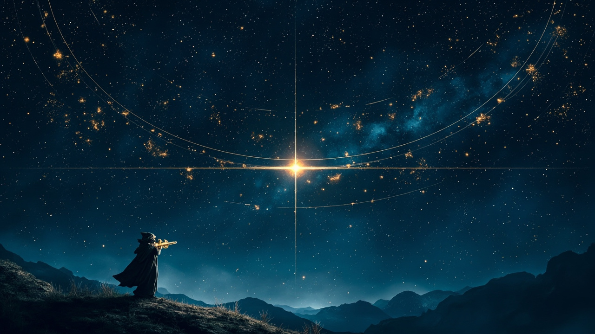
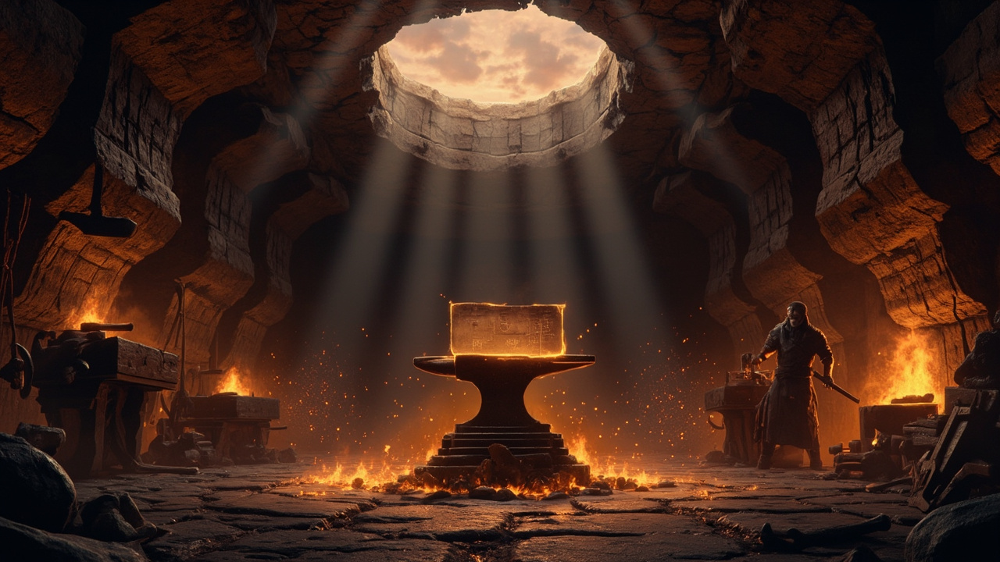
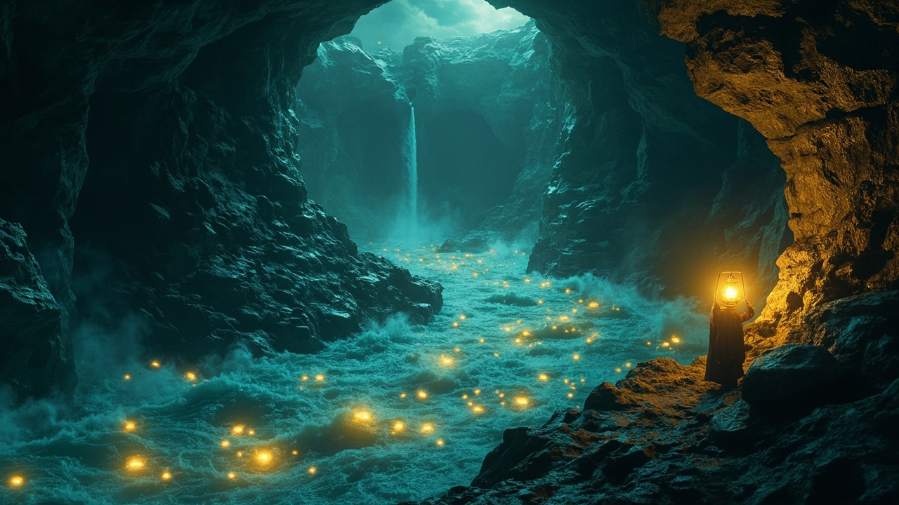

# media-gen

Epic fantasy banner generation for AI agents. One skill, multiple backends, no aesthetic re-explaining.

## What It Does

- **Prompts live here, not in your head.** Load the skill into any AI agent and it knows the aesthetic.
- **Pick any style, generate anywhere.** The image gen step is generic — use whatever tool is available.
- **Easy to extend.** Add new styles by filling in a template.

## The Aesthetic

Epic fantasy meets technical content. Massive scale, atmospheric depth, warm amber light against dark teal shadows. Grand scale with intimate human presence.

```
Deep teal:      #2a5a6a   (sky, water, shadows)
Dusk plum:      #8a5a6a   (accent, depth)
Golden amber:   #d4a574   (light, warmth)
Warm cream:     #e8dcc4   (stone, parchment)
Dark indigo:    #1a1a2a   (deep background)
```

## Style Gallery

Each style is a prompt template. Customize `[YOUR SUBJECT]` to match your content.

### B1: The Gilded Mechanism
*Code, engineering, agents, tools, architecture*

A massive brass gear suspended above dark teal water at twilight. Ancient machinery meets golden amber light.


**Prompt**: A single massive brass gear, thirty meters wide, suspended above dark teal water at twilight. [YOUR SUBJECT] integrated subtly into the gear's surface — [DESCRIBE HOW]. A tiny hooded figure stands on the gear's edge. Golden amber light catches the gear's teeth. Deep teal water below reflects the light. Cinematic, epic fantasy, hyper-detailed. No text, no logos.

---

### B2: The Flooded Archive
*Context, knowledge, memory, search, documentation*

A vast underground library flooded with dark water. Lanterns glow. Ancient scrolls float on the surface.



**Prompt**: A vast underground stone archive, its floor submerged in dark water that reflects the warm glow of floating lanterns above. [YOUR SUBJECT] — [DESCRIBE] — visible on ancient scrolls floating on the water. A single figure in scholar's robes rows a small boat through the waterway. Epic fantasy, surreal, hyper-detailed. No text, no logos.

---

### B3: The Observatory Throne
*Agents, strategy, planning, leadership*

Three stone figures on a misty mountain peak. A golden dawn breaks behind them. Monumental, serene.



**Prompt**: Three monumental stone figures, each seated on a simple throne, arranged on a narrow mountain peak above an endless sea of mist. A golden dawn light breaks behind distant mountains. [YOUR SUBJECT] glows faintly in each figure's hands. Mist fills the valley below. Epic fantasy, monumental scale, contemplative. No text, no logos.

---

### B4: The Star Map
*Predictions, vision, scope, overview, direction*

Constellation arcs on a deep indigo night sky. Stars forming patterns. A robed figure with an astrolabe looks up.



**Prompt**: A deep indigo night sky filled with hundreds of stars, five major constellation arcs crossing the heavens. [YOUR SUBJECT] shaped by the constellation paths. A glowing celestial equator divides the sky. Hyper-detailed astronomy chart meets epic fantasy. Rich indigo, gold, amber, teal. No text, no logos.

---

### B5: The Forge Below
*Building, making, construction, creation, engineering*

A vast underground forge. Amber light pours from a crack in the ceiling. An anvil, sparks, and smoke. Ancient craftsmanship.



**Prompt**: A vast underground forge carved into dark stone, a crack in the ceiling revealing a twilight sky and letting in shafts of golden light. [YOUR SUBJECT] resting upon the central anvil. A figure works at a side forge, sparks rising into darkness. Epic fantasy, hyper-detailed, warm and dramatic. No text, no logos.

---

### B6: The Deep Current
*Data, flow, streams, pipelines, distribution*

An underground river carrying glowing lights through a vast stone cavern. Data as luminescent creatures.



**Prompt**: A vast underground stone cavern, a wide river rushing through it. The water carries hundreds of small glowing lights — [YOUR SUBJECT] — drifting like luminescent river creatures downstream. Ancient stone arches. A robed figure watches the lights float past. Epic fantasy, surreal, atmospheric. No text, no logos.

---

More styles in [`skills/media-creation/STYLES.md`](skills/media-creation/STYLES.md).

## Quick Start

```bash
# 1. Clone and configure
git clone https://github.com/ameno-/media-gen.git
cd media-gen
cp config.example.sh config.sh
# Edit config.sh with your API keys

# 2. Source your config
source config.sh

# 3. Generate (pick your tool)
mmx image generate --prompt "Your prompt" --aspect-ratio 16:9

# or
python adapters/openrouter_image.py "Your prompt" -o output.png -a 16:9

# or
codex exec "$imagegen generate your prompt"
```

## Adding a New Style

Copy `docs/STYLE-TEMPLATE.md` to `skills/media-creation/` and fill it in. Every style needs:

1. A name and clear use case
2. A descriptive prompt template with `[YOUR SUBJECT]` and `[DESCRIBE HOW]` placeholders
3. Example output (generated image in `examples/`)
4. Service notes if the style works better on a specific backend

See [`docs/STYLE-TEMPLATE.md`](docs/STYLE-TEMPLATE.md) for the template.

## AI Agent Integration

### Letta Code
```bash
cp -r skills/media-creation ~/.letta/skills/
```

### Claude Code
```bash
cp -r skills/media-creation ~/.claude/skills/
```

The skill loads `STYLES.md` from the same directory. Say "generate a banner" and the agent picks the right style prompt, generates with whatever tool is available.

## File Structure

```
media-gen/
├── README.md
├── LICENSE
├── .gitignore
├── config.example.sh
├── skills/
│   └── media-creation/
│       ├── SKILL.md       # Entry point, style picker
│       ├── STYLES.md      # All style prompts
│       └── SERVICES.md    # Tool invocation
├── adapters/
│   └── openrouter_image.py
├── docs/
│   ├── SETUP.md
│   ├── CLI-INTEGRATION.md
│   └── STYLE-TEMPLATE.md  # ← Add new styles here
└── examples/             # Generated example outputs
```

## Security

No API keys in this repo. All keys are environment variables.

```bash
OPENROUTER_API_KEY   # OpenRouter (Nano Banana, Flux, GPT5 Image)
OPENAI_API_KEY       # Codex CLI batch / DALL-E
MINIMAX_API_KEY      # MiniMax CLI
```

Copy `config.example.sh` → `config.sh`, fill in keys, **never commit**.

## License

MIT
